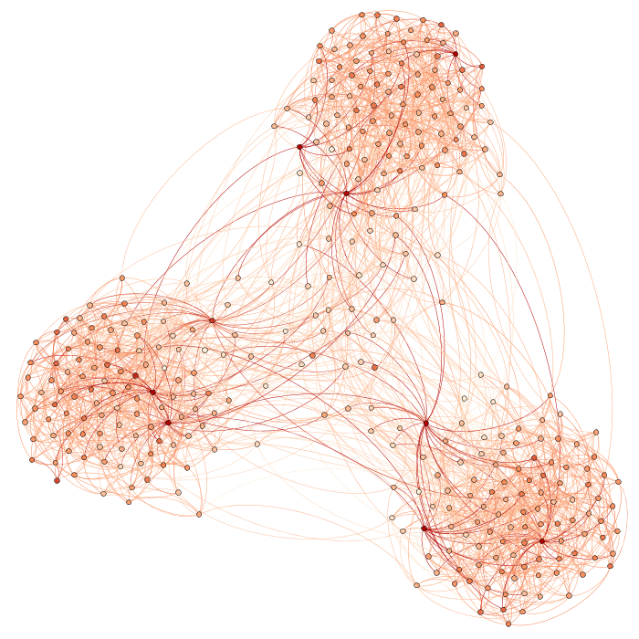
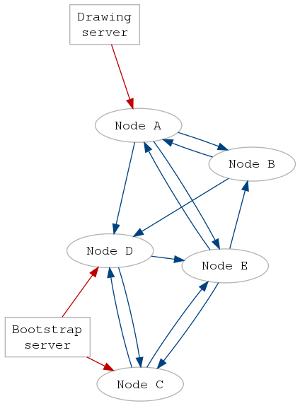

Amœba
======

Amœba is a program for setting up a decentralized network. The name comes from the hope that eventually, the network will be so robust that you can poke any of its parts without endangering its overall integrity.

The current development stage is Alpha.

Branch  | Status
:-----: | :-----:
stable  | 
master  | 
develop | 

Planned features
----------------

- Anonymity: every node only knows about its immediate neighbours. Unless explicitly added, the origin of a signal sent over the network is untraceable.

- The network should be as robust as possible against malicious participants.

- Even large network outages should not lead to disconnected components.

- Neat live graph drawing to have a global view of the entire network (or at least the nodes choosing to be published).

Also see the [issues list][issues] on GitHub.

[issues]: https://github.com/quchen/amoeba/issues

Research goals
--------------

- Structure

  - What node degrees are necessary for a robust network?

  - How long, if possible, does it take an almost dead node to heal again?

  - How does the network diameter scale with number of participants? This is important to ensure the shortest paths between arbitrary nodes stay short, ensuring fast message delivery.

  - What are the timescales for bootstrapping the network, adding or removing one node or many nodes?

  - How do two disconnected network components meld together when a connection is introduced?

- Integrity

  - What attacks can be prevented by design?

  - Worst case scenarios: what are malicious participants allowed to do?

These goals are subject to certain constraints:

- A node only knows its immediate neighbours. (No global knowledge hacks.)

- Network dynamics are static: a link is only broken by technical failure, and not as part of the network dynamics.

Network description
-------------------

The picture shows the network structure of a small Amœba network. Blue arrows are ordinary connections, while red ones stand for local direct connections, used by special network services.

### Normal nodes

- All nodes run identical programs.

- Each node has a number of upstream and downstream neighbours, which are allowed to send data to the current node, or accept data sent by it, respectively. It has no knowledge about the network other than its neighbours.

- Nodes have a minimum and maximum number of neighbours for both upstream and downstream connections (independent of each other). If there is a deficit of connections, nodes will request new neighbours from the network; if there is a surplus, no new connections will be accepted; if there is neither, no requests will be sent, but incoming requests will be processed.

- If a node has a deficit in connections, it will randomly tell one of its neighbours of it. This is called an *edge request*, and contains its own address, and parameters determining how far the request should travel through the network. The edge request is relayed by receiving nodes a number of times, passing it on to one of their own downstream neighbours, until eventually one of them accepts the request, and establishes the desired connection with the initially issuing node.

- Nodes will attempt to minimize the number of connections above the minimum by *pruning*. They will do so by telling downstream neighbours of their wish to drop the connection, which will be accepted if this can be done without making the partner go below the minimum limit.

- Initial connection is made using a special bootstrap service, see the section below.

- To look at the large scale structure of the network, a special request can be made by a special graph plot server. This request makes every client send a list of all its neighbours to the plot server. (This is strictly a debugging tool, since it opens the door for a truckload of attacks.)

### Special services

A central point in node design is that they reject signals from unregistered origins, so that spamming a single node from outside does not affect the network at all.

However, this is sometimes too restrictive: for some services, it makes sense to be able to issue signals, despite them not being part of the network. To solve this problem, nodes can be spawned with a special direct communication channel that can be used to send messages to it directly.

#### Bootstrap server

A bootstrap server is the first contact a node makes after startup, and issues edge requests on behalf of its client.

#### Drawing server

The drawing server's purpose is creating a map of the network to study its structure. Issues a signal that makes every (willing) node of the network send it a list of their downstream neighbours.

Known vulnerabilities and immunities
------------------------------------

This is a list of known and feasible attacks on the current design:

- Malicious single nodes

  - DDoS: Spamming the network with loads of trashy messages. Especially flooding signals (such as text messages) have a very large impact compared to the single signal they are issued with. Furthermore messages are anonymous, so if you have N neighbours, you can at least send N messages per malicious node without any possible spam protection being able to jump in.

  - Spamming the bootstrap server with requests yields an arbitrary amount of new edge requests, allowing a node to quickly connect to a large part of the network.

  - The drawing server capabilities are currently available to everyone, and not just legitimate drawing servers. In other words, getting a list of all nodes is trivial.

  - *Resistent*: SlowLoris attacks. Since signal sizes are relatively small, connection timeouts can be short.

  - Node crawling: Although nodes only retain the addresses of downstream neighbours (remember the upstream connection is one-way, clients will not send or handle signals issued the wrong way), edge requests carry valid server addresses and traverse part of the network before they are accepted. Specialized nodes could simply store all valid addresses they encounter. This is completely undetectable by other nodes and, while not dangerous on its own, can lead to knowledge about all of the network's participants. The node database could be shared with malicious nodes that could harness that information for attacks on the network.

  - There is no message size limit at the moment. A node will read incoming data until the connection for a single signal times out.

- Malicious sub-networks

  - Nodes accepting all edge requests they encounter can build up a connection to a large portion of the network. This opens the door for new attacks:

    - Filtering: Certain signals could be thrown away, for example edge requests from a certain IP range so that no new nodes can connect to the network

    - Altering signals

  - A test where two neighbours compare some of their neighbours and drop common ones could battle the possibility of nodes gathering up too many connections illegally.

  - *Immune:* Bootstrap takeover: The bootstrap server remembers all nodes it has helped spawn. Should the malicious network be able to bully out all legally known nodes, the bootstrap server would have to send the next request through the malicious network first. However, the newly spawned node now exists in the bootstrap server's database, providing a way through the blockade.

- Malicious swarms - right now it's trivial to spawn thousands of new nodes simultaneously. No matter how many honest nodes there are, it is very easy to drown them in a network controlled by a few actors behaving like they are many.

- Killing all bootstrap servers makes it impossible to discover the network.

Documentation
-------------

### Client structure

The picture below sketches the flow of information in a single Amœba client.

- Network connections are shown in red. Nodes first connect to another node's server (dashed red), which then relays them to their own private worker in the target node (by spawning a new worker, yellow dashed), at which point the data flows directly from node to worker.

- Workers take input from upstream nodes and formulate a response based on them. This response is then sent over the internal channels (blue) to the clients.

- Clients have persistent connections to downstream neighbours open (red network connections), and send the instructions received from the channels to them.

- The client pool watches internal databases to determine whether there are enough workers and clients. If not, it instructs existing clients to send requests for further neighbours.

### The protocol

The protocol type used by Amœba can be found in `src/Types/Signal.hs`. All signals are sent downstream, with one exception where relevant data actually flows upstream. Unless otherwise noted, the server answers signals with a `ServerSignal`, which can basically be `OK` or one of multiple possible errors. A usual request consists of a node sending a signal downstream and waiting for the response, terminating the worker if it is not positive.

Signals are divided in two main groups, normal and special. Normal signals are what usual nodes routinely use:

- `EdgeRequest` contains information for establishing a new edge in the network
- `KeepAlive` is sent in case there haven't been any useful signals, but the connection should not time out
- `ShuttingDown` is sent as a courtesy to other nodes, so they can remove a terminating node before the timeout kicks in
- `Flood` signals are distributed to every node in the network. Current instances are text messages and a request to send a `NeighbourList` to a drawing server.
- `Prune` is a request to downstream neighbours to drop the connection. This is an effort to keep the number of connections as low as possible, and the request will be accepted if dropping the connection does not cross the minimum threshold.

Normal signals are filtered: only when they're coming from known upstream nodes they are processed. Special signals circumvent this, as some processes inherently require unknown nodes to establish connections.

- `BootstrapRequest` is sent to the bootstrap server, and instructs it to send out `EdgeRequest`s on behalf of the contacting node.
- `Handshake` is what actually establishes a new connection. Sent to a new downstream neighbour, it adds the issuer to its list of known nodes and answers with `OK`; the issuer then does its own bookkeeping, and answers back `OK` as well, finalizing the deal with mutual agreement.
- `HandshakeRequest`s prompt another node to send back a `Handshake`. This allows `Handshake` to be used to establish incoming connections, not just outgoing ones by sending it directly.
- `NeighbourList` is sent from nodes to the drawing server. It contains the list of downstream neighbours.

### Terminology, abbreviations

These may help reading the source comments:

- _x:   Accessor functions that don't do any computation otherwise
- DSN:  Downstream node, i.e. a neighbouring node the current sends commands do.
- LDC:  Local direct connection. Used by the node pool to send signals directly to its nodes instead of taking a detour over the network.
- ST1C: Server to one (unspecified/arbitrary) client channel
- STC:  Server to client channel
- STSC: Server to specific client channel
- USN:  Upstream node, i.e. a neighbouring node the current gets commands sent by.
